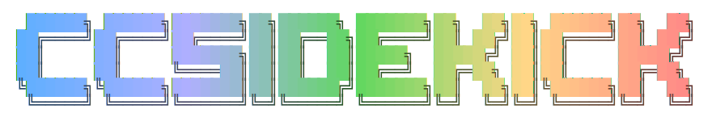

<p align="center">
  
</p>

<p align="center"><b>A Claude Code status line with a character that reacts to your session.</b> Full cost, git, and usage at a glance, at zero token spend.</p>

<p align="center">
  
  
  
  <a href="https://github.com/krayong/ccsidekick/actions/workflows/ci.yml"></a>
  <a href="https://www.npmjs.com/package/ccsidekick"></a>
  <!-- npm downloads badge hidden until launch (shows 0/month pre-adoption); restore once traffic ramps:
  <a href="https://www.npmjs.com/package/ccsidekick"></a>
  -->
  <a href="LICENSE"></a>
</p>

<p align="center">
  
  
  
  
  
</p>

<p align="center">
  
</p>

## What you get

- **A character that reacts.** It notices what Claude is doing (tests passing, builds breaking,
  commits landing, a struggle and then a recovery) and comments in character, warming to you across
  sessions through familiarity tiers.
- **A real status line.** 33 toggleable widgets: directory, model, git (branch, ahead/behind,
  staged/unstaged/untracked, uncommitted changes, stash, worktree, conflicts), token context, cost,
  usage limits, PR state, burn rate, and more. Threshold-colored.
- **75+ built-in themes.** Dark, high-contrast, and retro palettes (Dracula, Nord,
  Catppuccin, Tokyo Night, Gruvbox, Rosé Pine, Synthwave '84, and dozens more), including one tuned
  to each character pack.
- **Cost at a glance.** Chat, per-project, and all-time spend, read straight from your Claude Code
  transcripts. No token spend and nothing extra to install.
- **Character spinner verbs.** The active character rewrites Claude Code's spinner verbs, so even
  the loading text stays in persona.

## Install

```bash
npx ccsidekick
```

Running `ccsidekick` in a terminal opens the setup UI. On a first run it walks you through a short
guided **wizard** (character → theme → comments); later runs open the full **dashboard** to change
config or view stats, and either view can switch to the other with Ctrl+W / Ctrl+D. It wires
everything into Claude Code's `settings.json` (backing the file up first). Run
`npx ccsidekick --help` for every command, including a clean uninstall.

Prefer no TTY? `npx ccsidekick setup --character spiderman --theme houston --mode fixed` configures and
wires everything from flags. See [Non-interactive setup](#non-interactive-setup).

## Characters

Every character ships bundled with the engine, so a fresh install has them all — no download or
install step. Pick and switch between them in the **Character** section (or the wizard): fixed mode
pins one, random mode rotates a roster.

Each pack is data, never code: a single sourced ASCII figure (credited to its original artist; mood
adds color-only effects, never a new frame), a curated message library, and at least twenty-five
in-voice spinner verbs. Out of the box ccsidekick runs in random mode over the full roster, picking a
character per session; `spiderman` is the default only when you pin one in fixed mode.

**Available packs:**

- **Barbie**: a bright, upbeat pack in signature pink, with a matching theme.
- **Batman**: an edgy, cowled sidekick in a dark cowl-and-night palette, with a matching theme.
- **Ben 10**: a mild, cocky kid-hero pack in Omnitrix lime.
- **Darth Vader**: an edgy, imperious Sith pack in ember red and cold steel.
- **Deadpool**: an offensive-tone merc pack in Deadpool red, with a matching theme.
- **Gandalf**: a mild, wise wizard pack in White Rider silver and gold.
- **Harry Potter**: a wizarding pack in Gryffindor scarlet and gold.
- **Hello Kitty**: a sweet, wholesome pack with a soft blush-pink theme.
- **Iron Man**: an edgy, quippy genius pack in hot-rod red, gold, and arc-reactor cyan.
- **James Bond**: an edgy secret-agent pack in cool gunmetal blue, with a matching theme.
- **Joker**: an edgy, chaos-loving pack in Joker purple and acid green.
- **Naruto**: a mild, hot-blooded ninja pack in ramen orange and Rasengan blue.
- **Pikachu**: a mild, upbeat pack that crackles in electric yellow.
- **Sherlock Holmes**: a mild, deductive pack in muted Victorian sepia.
- **Shin-chan**: an edgy, snack-obsessed kid pack in sunny yellow.
- **Spider-Man**: a milder, wisecracking pack with a red-and-blue theme to match.
- **Superman**: a mild, hopeful pack in Metropolis blue and cape red.
- **Yoda**: a mild, patient Jedi pack in Dagobah green.

**…and more on the way.** New characters land as they're authored.

Each pack registers its theme as a selectable option, so every bundled character also adds a
palette. Authoring your own is a documented path; see below.

## Non-interactive setup

No terminal required — configure and wire ccsidekick from flags, ideal for scripts and AI agents:

```bash
npx ccsidekick setup --character spiderman --theme houston --mode fixed
```

Only the flags you pass are applied (a partial patch onto the existing config, or the defaults on a
fresh install); it then writes `config.toml` and wires `settings.json` exactly like the TUI. Flags
map to config fields: `--character`, `--mode`, `--roster`, `--theme` (`character` = match the
character, the default), `--currency`, `--budget`, `--comments <on|off>`, `--helpful <on|off>`,
`--min-severity`, `--widgets`, plus `--global` / `--local` and `--config-dir`.

Discover valid values and every flag:

```bash
npx ccsidekick list characters   # also: themes, widgets
npx ccsidekick setup --help
```

An unknown value (a misspelled theme, say) exits non-zero and prints the valid set; it never
silently falls back to a default.

## Configuration

A hand-editable TOML file at `${CLAUDE_CONFIG_DIR:-~/.claude}/ccsidekick/config.toml` (a per-project
`.ccsidekick/config.toml` overrides it), with the TUI on top. The tables mirror the dashboard
sections, in order. A representative subset:

```toml
schema_version = 1

[character]
mode = "random"       # fixed | random  (random picks once per session)
name = "spiderman"    # active pack in fixed mode; the default
roster = []           # pool for random mode (empty = all characters)

[theme]
name = "character"    # "character" matches the active character; or any built-in / pack theme (default: character)
mood_shift = false    # re-tint accent + gradient with the current mood

[comments]
character = true      # the character's voice line (tone stays pack-owned)
helpful = true        # actionable tips above the field rows
min_severity = "low"  # low | medium | high | critical

[network]
fx_refresh = false    # off by default; weekly currency-rate refresh when on
usage_fetch = false   # off by default; the account-usage widget sends your OAuth token to Anthropic

[statusline]
currency = "USD"      # local-currency parenthetical on cost; default follows your system locale
```

### Widgets

Every field is toggled in `[statusline.widgets]` (the engine owns order and placement). The ids:
`dir`, `added_dirs`, `session_name`, `git_branch`, `git_hash`, `git_tag`, `git_worktree`,
`git_changes`, `git_ahead_behind`, `git_status`, `git_conflict`, `git_operation`, `git_stash`, `pr`,
`model`, `fast_mode`, `thinking`, `output_style`, `agent`, `context_usage`, `compactions`,
`cost_chat`, `cost_project`, `cost_total`, `cost_burn`, `block_usage`, `weekly_usage`, `balance`,
`pay_as_you_go`, `cache_hit`, `token_burn`, `session_duration`, `todo`.

## How it works

```
Claude Code ──stdin JSON──▶  ccsidekick-render render  ──stdout ANSI──▶  status line (main agent only)
                                      ▲
three PostToolUse-family hooks ──ccsidekick-render classify──▶  events log + state  (disk only, no API, no tokens)
```

State lives under `${CLAUDE_CONFIG_DIR:-~/.claude}/ccsidekick/`, partitioned per session so two
Claude windows never collide. Git runs fresh each tick; cost reads sit behind a short-lived cache.
The render path runs under plain Node and ships as a precompiled bundle, so the per-tick cost stays low.

## Development

A Bun workspace. The engine is `packages/core` (published as `ccsidekick`); each character is
`packages/packs/<name>` (published as `@ccsidekick/pack-<name>`).

```bash
bun install
bun test
```

See [CONTRIBUTING.md](CONTRIBUTING.md) for the full toolchain (TypeScript, ESLint, Prettier, native
`.githooks`) and [CLAUDE.md](CLAUDE.md) for the load-bearing invariants. The render path carries no
runtime dependencies the user manages.

<details>
<summary>Build and run from source</summary>

Building locally needs [Bun](https://bun.sh) for the build and Node 20.6+ to run.

```bash
git clone https://github.com/krayong/ccsidekick.git
cd ccsidekick
bun install         # workspace deps + git hooks
bun run link:global # build, then symlink both commands into ~/.local/bin
```

`link:global` puts `ccsidekick` and `ccsidekick-render` on your PATH (make sure `~/.local/bin` is on
it). Re-run it after pulling changes to rebuild and relink.

</details>

<details>
<summary>The two binaries</summary>

The package ships two executables:

- **`ccsidekick-render`** is the lean hot path. Claude Code calls `ccsidekick-render render` on
  every statusline tick and `ccsidekick-render classify` on every tool call. It loads no UI and runs
  under plain Node.
- **`ccsidekick`** is the user-facing entry: the setup TUI plus `setup`, `list`, and `uninstall`.
  Only the TUI loads the Ink interface; `setup`/`list`/`uninstall` run under plain Node.

</details>

### Authoring a character pack

Art is sourced through tooling, never hand-drawn, and every figure credits its creator. The
`ascii-art` image-to-ASCII skill supplies figures; the authoring kit width-normalizes them, checks
coverage and legibility, and generates the pack's `README.md` with a statusline preview rendered in
the pack's own theme. The full contract lives in the `pack-author` skill (
`.claude/skills/pack-author`).

## Inspirations

Prior art in Claude Code statuslines, coding-companion pets, and transcript-based usage accounting:

- [ccusage/ccusage](https://github.com/ccusage/ccusage)
- [sirmalloc/ccstatusline](https://github.com/sirmalloc/ccstatusline)
- [jarrodwatts/claude-hud](https://github.com/jarrodwatts/claude-hud)
- [Haleclipse/CCometixLine](https://github.com/Haleclipse/CCometixLine)
- [rz1989s/claude-code-statusline](https://github.com/rz1989s/claude-code-statusline)
- [leeguooooo/claude-code-usage-bar](https://github.com/leeguooooo/claude-code-usage-bar)
- [nilbuild/claude-statusline](https://github.com/nilbuild/claude-statusline)
- [vincent-k2026/codachi](https://github.com/vincent-k2026/codachi)

## Credits

Every character figure credits its original ASCII artist in the pack's `attribution`. The characters
themselves are unofficial fan art of trademarked properties. ccsidekick is a non-commercial hobby
project, not affiliated with or endorsed by any rights-holder, and any figure is removed on request.

## Contact

Bugs and feature requests belong in [GitHub Issues](https://github.com/krayong/ccsidekick/issues);
security reports go through
a [Security Advisory](https://github.com/krayong/ccsidekick/security/advisories/new). For anything
else, email [ccsidekick@krayong.com](mailto:ccsidekick@krayong.com).

## License

[MIT](LICENSE) © Karan Gourisaria. The MIT license covers ccsidekick's own code. The character
figures are unofficial fan art of trademarked properties owned by their respective rights-holders;
each ASCII rendering is credited to the artist who drew it (per pack), and figures are removed on a
rights-holder's request.
