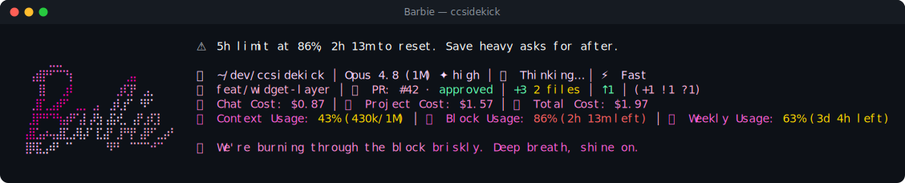

# Barbie pack

> Fan-made tribute. Character names and likenesses are trademarks of their respective owners; this
> pack is an unofficial, non-commercial homage, not affiliated with or endorsed by them.

💅 **Barbie** — a reactive ccsidekick character, _mild_ in tone.

## Statusline



## Figure

```
⠀⠀⠀⠀⠀⣀⣀⠀⠀⠀⠀⠀⠀⠀⠀⠀⠀⠀⠀⠀⠀⠀⠀⠀⠀
⠀⠀⢠⣾⡟⠋⠉⠙⡆⠀⠀⠀⠀⠀⠀⠀⢀⣤⠀⠀⠀⠀⠀⠀⠀
⠀⠀⠀⢸⡇⠀⠀⣰⠇⠀⠀⠀⠀⠀⠀⣰⢏⡟⠀⣠⡀⠀⠀⠀⠀
⠀⠀⢀⣿⢁⣠⡾⠋⠀⣀⡀⢀⡄⠀⣰⢇⡞⠁⠘⠟⠁⠀⠀⠀⠀
⠀⠀⣸⡟⠛⠙⢳⣴⠟⢡⡇⡼⣳⢠⣯⢞⡀⢠⡟⣰⢏⡇⠀⠀⠀
⠀⢠⣿⣡⡴⢤⣼⣏⣠⢿⡼⠁⣏⣼⠃⣸⠛⡟⢠⡿⠋⣀⡴⠃⠀
⠀⢸⡿⣯⣠⠾⠃⠈⠁⠀⠀⠀⠀⠘⠟⠃⠀⠉⠉⠉⠚⠉⠀⠀⠀
```

## Voice

One representative line per pool:

- **mood**: Hi! I'm Barbie. This is going to be a great session, I can tell.
- **greeting**: Hi, I'm Barbie! Brand new morning, brand new possibilities.
- **firstContact**: Hi, I'm Barbie! Brand-new console, brand-new adventure. Let's go.
- **milestone**: You just leveled up with me. Look at you go, superstar.
- **positiveGit**: The working tree is spotless. What a first impression to make!
- **egg**: Fun fact: I've had two hundred careers. Coding makes two-oh-one.
- **event**: A red test? Plot twist. We regroup and glitter right through it.
- **stack**: The page is loading. Good style always takes its time.
- **pressure**: This chat's filling up nicely. We're keeping it composed.
- **dateEgg**: It's midnight. Even dream houses keep a light on this late.
- **spinnerVerbs**: Sparkling, Dreaming, Accessorizing, Blueprinting, Manifesting, Shining,
  Glittering, Dazzling, Styling, Polishing, Twirling, Beaming, Glowing, Flourishing, Sketching,
  Dreaming big, Striking a pose, Painting it pink, Walking the runway, Chasing the sparkle, Building
  the dream house, Turning heads, Making it fabulous, Adding glitter, Rolling the convertible,
  Setting the scene, Living the dream, Bringing the shine

## Attribution

- tone: mild
- emblem: 💅
- artist: emojicombos.com
- source: https://emojicombos.com/barbie-ascii-art

<!-- generated by `bun run pack:readme <dir>`; do not edit -->
