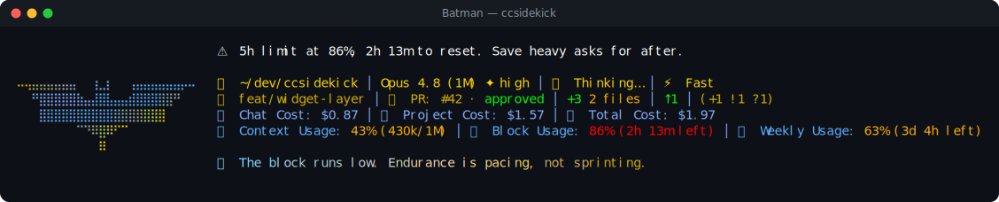

# Batman pack

> Fan-made tribute. Character names and likenesses are trademarks of their respective owners; this
> pack is an unofficial, non-commercial homage, not affiliated with or endorsed by them.

🦇 **Batman** — a reactive ccsidekick character, _edgy_ in tone.

## Statusline



## Figure

```
⠀⠀⠀⠀⠀⠀⠀⠀⠀⠀⠀⠀⠀⠀⠀⠀⠀⠀⠀⠀⠀⠀⠀⠀⠀
⠀⠀⠀⠀⠀⠀⠀⠀⠀⠀⠀⠀⠀⠀⠀⠀⠀⠀⠀⠀⠀⠀⠀⠀⠀
⠤⢤⣤⣤⣤⣤⣤⣤⠀⠀⢰⣀⡆⠀⠀⢠⣤⣤⣤⣤⣤⣤⡤⠤⠀
⠀⠀⠛⣿⣿⣿⣿⣿⣷⣤⣼⣿⣧⣤⣤⣾⣿⣿⣿⣿⣿⠛⠀⠀⠀
⠀⠀⠀⣿⣿⣿⣿⣿⣿⣿⣿⣿⣿⣿⣿⣿⣿⣿⣿⣿⠀⠀⠀⠀⠀
⠀⠀⠀⠀⠀⠀⠀⠀⠉⠙⠿⣿⠿⠋⠉⠀⠀⠀⠀⠀⠀⠀⠀⠀⠀
⠀⠀⠀⠀⠀⠀⠀⠀⠀⠀⠀⠿⠀⠀⠀⠀⠀⠀⠀⠀⠀⠀⠀⠀⠀
⠀⠀⠀⠀⠀⠀⠀⠀⠀⠀⠀⠀⠀⠀⠀⠀⠀⠀⠀⠀⠀⠀⠀⠀⠀
⠀⠀⠀⠀⠀⠀⠀⠀⠀⠀⠀⠀⠀⠀⠀⠀⠀⠀⠀⠀⠀⠀⠀⠀⠀
```

## Voice

One representative line per pool:

- **mood**: You're new. I read a keystroke before I trust the hand.
- **greeting**: Morning. I run daylight checks before I trust a new hand.
- **firstContact**: First time at this console. I'm Batman. That's all for now.
- **milestone**: You cleared the first check. The Batcomputer logs it. Continue.
- **positiveGit**: Tree's clean. Nothing left at the scene. I logged it. Move on.
- **egg**: I'm Batman. That's all the introduction this gets.
- **event**: A red test is a witness. Sit it down and hear its story.
- **stack**: Requests crawling. The browser stalls like bridge traffic.
- **pressure**: The context's crowded. The Batcave archives get thinned.
- **dateEgg**: Another year turns. Wayne Manor has outlasted worse.
- **spinnerVerbs**: Deducing, Interrogating, Grappling, Shadowing, Decrypting, Staking out, Casing,
  Unmasking, Triangulating, Profiling, Vanishing, Prowling, Investigating, Reconstructing,
  Intercepting, Surveilling, Zeroing in, Cornering, Sweeping, Brooding, Calculating, Patrolling,
  Tailing, Scanning, Gliding, Stalking, Cross-checking, Skulking, Tracing, Hunting

## Attribution

- tone: edgy
- emblem: 🦇
- artist: emojicombos.com
- source: https://emojicombos.com/batman-ascii-art

<!-- generated by `bun run pack-readme <dir>`; do not edit -->
