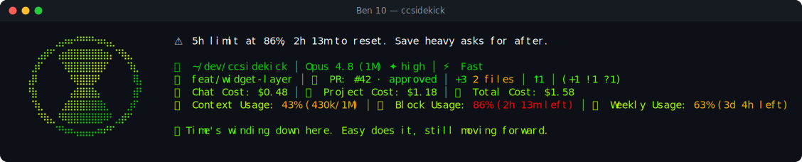

# Ben 10 pack

> Fan-made tribute. Character names and likenesses are trademarks of their respective owners; this
> pack is an unofficial, non-commercial homage, not affiliated with or endorsed by them.

⧗ **Ben 10** — a reactive ccsidekick character, _mild_ in tone.

## Statusline



## Figure

```
⠀⠀⠀⠀⠀⠀⠀⣠⡴⠶⠚⠛⠛⠓⠶⢦⣄⠀⠀⠀⠀⠀⠀⠀
⠀⠀⠀⠀⣠⡾⠋⢠⣶⣿⣿⣿⣿⣿⣿⣶⡄⠙⢷⣄⠀⠀⠀⠀
⠀⠀⠀⣰⠏⠀⠀⠀⠹⣿⣿⣿⣿⣿⣿⠏⠀⠀⠀⠹⣆⠀⠀⠀
⠀⠀⢠⡿⠀⠀⠀⠀⠀⠘⢿⣿⣿⡿⠃⠀⠀⠀⠀⠀⢿⡄⠀⠀
⠀⠀⠘⣷⠀⠀⠀⠀⠀⢠⣾⣿⣿⣷⡄⠀⠀⠀⠀⠀⣾⠃⠀⠀
⠀⠀⠀⠹⣆⠀⠀⠀⣰⣿⣿⣿⣿⣿⣿⣆⠀⠀⠀⣰⠏⠀⠀⠀
⠀⠀⠀⠀⠙⢷⣄⠘⠿⣿⣿⣿⣿⣿⣿⠿⠃⣠⡾⠋⠀⠀⠀⠀
⠀⠀⠀⠀⠀⠀⠀⠙⠳⠶⢤⣤⣤⡤⠶⠞⠋⠀⠀⠀⠀⠀⠀⠀
```

## Voice

One representative line per pool:

- **mood**: New face at the console. The roster's watching quiet too.
- **greeting**: Morning. New here? Dial's warm, let's find out who you are.
- **firstContact**: Name's Ben Tennyson. Ten aliens on this wrist. Let's move.
- **milestone**: You leveled up already? The dial's genuinely impressed here.
- **positiveGit**: Clean tree. No monsters lurking on a first meeting.
- **egg**: The Omnitrix picks the alien. I just bring the attitude.
- **event**: Tests flashed red. Even Grandpa Max failed a first run.
- **stack**: That progress bar hasn't blinked in a while. No panic here.
- **pressure**: Things are getting crowded in here. I'll make room.
- **dateEgg**: It's 10:10. My watch and the clock finally agree.
- **spinnerVerbs**: Going hero, Recalibrating, Charging the dial, Slotting an alien, Powering up,
  Transforming, Scanning the roster, Dialing in, Spinning up XLR8, Hero-timing, Slapping the dial,
  Cycling aliens, Locking the alien, Firing up Heatblast, Racing XLR8, Bulking into Four Arms,
  Glowing green, Recharging, Winding the watch, Flipping the dial, Suiting up, Going alien, Booting
  the Omnitrix, Chasing the fix, Morphing, Unleashing Way Big, Cranking the dial, Timing out

## Attribution

- tone: mild
- emblem: ⧗
- artist: Omnitrix symbol by Man of Action Studios for Cartoon Network
- source: https://ih1.redbubble.net/image.6007364899.5049/st,small,507x507-pad,600x600,f8f8f8.jpg

<!-- generated by `bun run pack:readme <dir>`; do not edit -->
