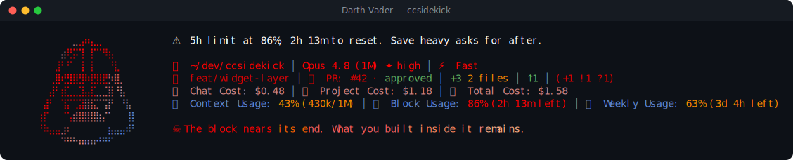

# Darth Vader pack

> Fan-made tribute. Character names and likenesses are trademarks of their respective owners; this
> pack is an unofficial, non-commercial homage, not affiliated with or endorsed by them.

☠ **Darth Vader** — a reactive ccsidekick character, _edgy_ in tone.

## Statusline



## Figure

```
⠀⠀⠀⠀⠀⠀⣀⣠⠶⣄⣀⠀⠀⠀⠀⠀⠀
⠀⠀⠀⠀⣴⢟⡭⢹⠀⡏⠉⠻⣦⠀⠀⠀⠀
⠀⠀⠀⣸⠃⠋⠀⢸⠀⡇⠀⠀⠘⣇⠀⠀⠀
⠀⠀⢀⣿⢞⣻⣿⣻⠷⣟⣿⣟⡳⣿⡀⠀⠀
⠀⠀⣼⠃⣾⣁⣀⣹⣤⣏⣀⣈⣿⠘⣧⠀⠀
⠀⣼⠃⠀⢹⡍⢉⣽⣿⣯⡉⢩⡟⠀⠘⣧⠀
⢰⡏⠀⠀⠈⢡⣾⣿⣿⣿⣷⡌⠁⠀⠀⢸⡇
⠘⠷⣤⣤⣰⠆⠀⠀⠀⠀⠀⠀⣦⣤⣤⠾⠃
⠀⠀⠀⠀⠙⠛⠓⠶⠶⠶⠚⠛⠋⠀⠀⠀⠀
```

## Voice

One representative line per pool:

- **mood**: Another presence enters my perception. Unproven, for now.
- **greeting**: Another dawn. State your purpose at the terminal.
- **firstContact**: A new presence enters my domain. Explain yourself.
- **milestone**: Your presence grows heavier on the deck. Noted.
- **positiveGit**: No debris in your wake. Unusual, for one so new.
- **egg**: You came looking. I permit this one audience.
- **event**: The tests resist. Good. Untrained strength shows itself.
- **stack**: The page loads at its own pace. Endure it.
- **pressure**: The context fills. A campaign this full builds a keener mind.
- **dateEgg**: The old year ends. Even an Empire marks its turning point.
- **spinnerVerbs**: Commanding, Converging, Force-drawing, Dominating, Meditating, Brooding,
  Scheming, Calculating, Marshaling, Subjugating, Channeling, Compelling, Enforcing, Overpowering,
  Foreseeing, Constricting, Besieging, Tightening, Advancing, Prevailing, Summoning, Directing,
  Manifesting, Conquering, Suppressing, Force-choking, Reckoning, Ascending

## Attribution

- tone: edgy
- emblem: ☠
- artist: emojicombos.com
- source: https://emojicombos.com/darth-vader-ascii-art

<!-- generated by `bun run pack-readme <dir>`; do not edit -->
