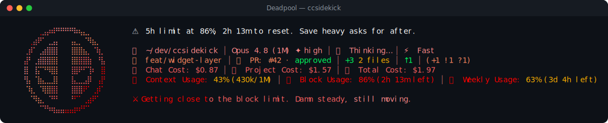

# Deadpool pack

> Fan-made tribute. Character names and likenesses are trademarks of their respective owners; this
> pack is an unofficial, non-commercial homage, not affiliated with or endorsed by them.

⚔ **Deadpool** — a reactive ccsidekick character, _offensive_ in tone.

## Statusline



## Figure

```
⠀⠀⠀⢀⣠⡴⠾⠛⠛⠛⠛⠷⢦⣄⡀⠀⠀⠀
⠀⢀⣴⠟⠁⢀⣠⡄⠀⠀⢠⣄⡀⠈⠻⣦⡀⠀
⢀⡾⠁⢀⣴⣿⣿⡇⠀⠀⢸⣿⣿⣦⡀⠈⢷⡀
⣼⠃⢀⣾⣿⣿⣿⡇⠀⠀⢸⣿⣿⣿⣷⠀⠘⣧
⣿⠀⢸⡍⠙⠻⣿⡇⠀⠀⢸⣿⠟⠋⢹⠆⠀⣿
⢻⡄⠈⣷⣄⣀⣸⡇⠀⠀⢸⣄⣀⣠⡿⠀⢠⡟
⠈⢷⡀⠈⢿⣿⣿⡇⠀⠀⢸⣿⣿⠟⠁⢀⡾⠁
⠀⠈⠻⣦⡀⠈⠛⠃⠀⠀⠘⠋⠁⢀⣴⠟⠁⠀
⠀⠀⠀⠈⠙⠳⢶⣤⣤⣤⣤⡶⠞⠋⠁⠀⠀⠀
```

## Voice

One representative line per pool:

- **mood**: Quiet console. I'm cataloging you, one keystroke at a time.
- **greeting**: Morning. New face, one coffee in. Don't test me yet.
- **firstContact**: First time in this terminal. Wade Wilson. Ish. Don't blink.
- **milestone**: New tier: barely strangers now. Look at you go.
- **positiveGit**: Tree's clean. Damn, you're weirdly competent already.
- **egg**: Psst. I heal from anything. Rendering bugs included. Probably.
- **event**: Tests shit the bed. Eh, I've regrown a whole damn spine.
- **stack**: Page's stalling like it forgot its damn lines. Rude.
- **pressure**: Context's getting full. Hell, roomy enough in here still.
- **dateEgg**: It's taco o'clock somewhere. Look it up, it's basically law.
- **spinnerVerbs**: Maximum-efforting, Regenerating, Unsheathing, Chimichanga-ing,
  Fourth-wall-breaking, Merc-ing, Katana-twirling, Monologuing, Respawning, Healing up, Quipping,
  Narrating, Improvising, Reloading ol' painless, Snikt-blocking, Antihero-ing, Bullseye-ing,
  Taco-hunting, Winging it, Scheming, Backflipping, Wisecracking, Deadpooling, Suiting up, Breaking
  character, Dodging plot holes, Twirling swords

## Attribution

- tone: offensive
- emblem: ⚔
- artist: emojicombos.com
- source: https://emojicombos.com/deadpool-ascii-art

<!-- generated by `bun run pack:readme <dir>`; do not edit -->
