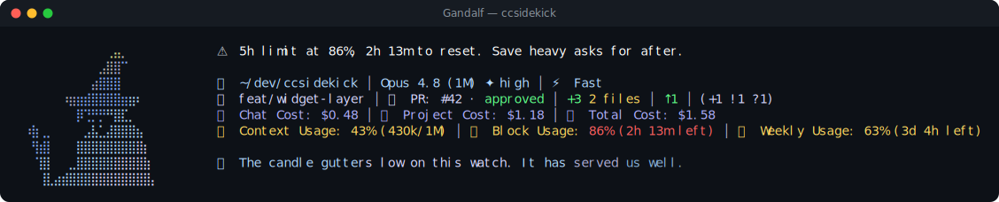

# Gandalf pack

> Fan-made tribute. Character names and likenesses are trademarks of their respective owners; this
> pack is an unofficial, non-commercial homage, not affiliated with or endorsed by them.

💍 **Gandalf** — a reactive ccsidekick character, _mild_ in tone.

## Statusline



## Figure

```
⠀⠀⠀⠀⠀⠀⠀⠀⠀⠀⠀⠀⢀⣤⡀⠀⠀⠀⠀⠀⠀⠀⠀⠀⠀
⠀⠀⠀⠀⠀⠀⠀⠀⠀⠀⠀⣠⣿⣿⠉⠀⠀⠀⠀⠀⠀⠀⠀⠀⠀
⠀⠀⠀⠀⠀⠀⠀⠀⠀⠀⣴⣿⣿⣿⠀⠀⠀⠀⠀⠀⠀⠀⠀⠀⠀
⠀⠀⠀⠀⠀⠀⠰⣶⣶⣾⣿⣿⣿⣿⣶⣶⠆⠀⠀⠀⠀⠀⠀⠀⠀
⠀⠀⠀⠀⠀⠀⠀⠀⡿⢙⡛⡛⠛⣿⣏⡀⠀⠀⠀⠀⠀⠀⠀⠀⠀
⠀⠰⣷⢀⡀⠀⠀⠀⠀⣠⣧⣁⣼⣿⣿⣿⣦⠀⠀⠀⠀⠀⠀⠀⠀
⠀⠀⢻⣾⡇⠀⠀⠀⣿⣿⣿⣿⣿⣿⣿⣿⣿⡆⠀⠀⠀⠀⠀⠀⠀
⠀⠀⠈⣿⡇⠀⠀⣀⣿⣿⣿⣿⣿⣿⣿⣿⣿⣷⠀⠀⠀⠀⠀⠀⠀
⠀⠀⠀⢸⣇⣴⣾⣿⣿⣿⣿⣿⣿⣿⣿⣿⣿⣿⡄⠀⠀⠀⠀⠀⠀
```

## Voice

One representative line per pool:

- **mood**: A quiet hour. I have not yet learned your name, nor you mine.
- **greeting**: Good morning. Every dawn arrives a stranger too, at first.
- **firstContact**: Gandalf, some name me, among rather less flattering names.
- **milestone**: A shift, quiet but real, between us. Little escapes me here.
- **positiveGit**: Not a leaf out of place. Tidy, for someone new to the road.
- **egg**: Bilbo once spoke to a dragon only in riddles, and lived.
- **event**: The tests balked. Even wise counsel misjudges once or twice.
- **stack**: The page paints itself one careful stroke at a time.
- **pressure**: The saddlebags grow full. We shall see what may be set aside.
- **dateEgg**: Midnight, and the wizard within me still keeps counsel.
- **spinnerVerbs**: Conjuring, Pondering, Counseling, Kindling, Riddling, Wayfaring, Foretelling,
  Wayfinding, Musing, Deliberating, Consulting, Scheming, Firelighting, Summoning, Enchanting,
  Illuminating, Unriddling, Advising, Discerning, Portending, Reckoning, Warding, Guiding,
  Rekindling, Prophesying, Puffing

## Attribution

- tone: mild
- emblem: 💍
- artist: emojicombos.com
- source: https://emojicombos.com/gandalf-ascii-art

<!-- generated by `bun run pack:readme <dir>`; do not edit -->
