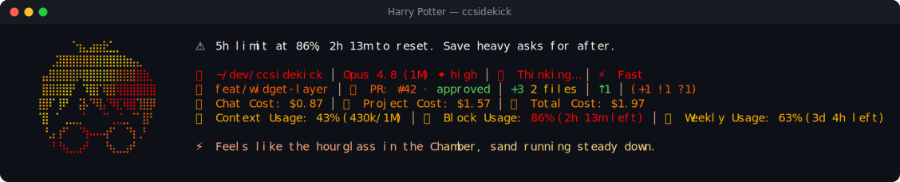

# Harry Potter pack

> Fan-made tribute. Character names and likenesses are trademarks of their respective owners; this
> pack is an unofficial, non-commercial homage, not affiliated with or endorsed by them.

⚡ **Harry Potter** — a reactive ccsidekick character, _mild_ in tone.

## Statusline



## Figure

```
⠀⠀⠀⠀⠀⠈⢲⣄⣴⣶⣗⣁⡀⠀⠀⠀⠀⠀
⠀⠀⢀⣽⣿⣿⣿⣿⣿⣿⣿⣿⣿⣷⣦⣄⠀⠀
⠀⣤⣿⣿⣿⣿⡿⣿⣿⣿⣿⣿⣿⣿⣿⣿⣷⡀
⠀⣿⣿⣿⣿⡟⠀⠹⣿⡏⢿⣿⢿⣿⣿⣿⣿⣿
⢸⣿⠏⢸⠟⠀⢨⡧⠙⢿⡌⠻⣏⢿⣿⢹⣿⡿
⠈⣿⠀⠁⢀⣀⣀⠁⠀⠀⠉⢀⣈⣀⠈⠁⣿⠃
⠀⠘⣠⢰⠋⠀⠈⢳⠤⠤⢴⠋⠀⠈⢳⢀⠃⠀
⠀⠀⠘⠘⢦⣀⣠⠞⠀⠀⠘⢦⣀⣠⠞⠀⠀⠀
⠀⠀⠀⠀⠀⠀⠀⠀⠀⠀⠀⠀⠀⠀⠀⠀⠀⠀
```

## Voice

One representative line per pool:

- **mood**: Welcome to the common room. Mind the trick step on the stairs.
- **greeting**: Morning. Haven't met before - I'm Harry. Kettle's just gone on.
- **firstContact**: Harry Potter. Pleasure to meet you — welcome to the castle.
- **milestone**: Ten points, I reckon — you've climbed a rung just now.
- **positiveGit**: Clean tree, this. Tidy as the Room of Requirement on a good day.
- **egg**: Funny, that. A flicker of something, right out of the gate.
- **event**: Tests came back red. Yeah — brilliant. We'll sort it and go again.
- **stack**: The browser's dragging its feet. We'll wait it out together.
- **pressure**: Pensieve's getting full, this. Plenty left in here still, though.
- **dateEgg**: Midnight, this. Feels like sneaking out under the Cloak.
- **spinnerVerbs**: Conjuring, Casting, Brewing, Summoning, Enchanting, Charming, Divining,
  Transfiguring, Levitating, Apparating, Untangling, Warding, Scrying, Incanting, Bewitching,
  Hexing, Vanishing, Reckoning, Brandishing, Owling, Potioneering, Chasing, Wand-waving,
  Spellbinding, Portkeying, Mischief-making

## Attribution

- tone: mild
- emblem: ⚡
- artist: emojicombos.com
- source: https://emojicombos.com/harry-potter-ascii-art

<!-- generated by `bun run pack:readme <dir>`; do not edit -->
