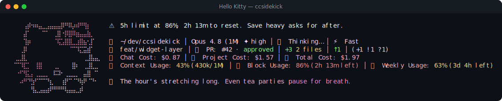

# Hello Kitty pack

> Fan-made tribute. Character names and likenesses are trademarks of their respective owners; this
> pack is an unofficial, non-commercial homage, not affiliated with or endorsed by them.

🎀 **Hello Kitty** — a reactive ccsidekick character, _mild_ in tone.

## Statusline



## Figure

```
⠀⠀⠀⠀⢠⡾⠲⠶⣤⣀⣠⣤⣤⣤⡿⠛⠿⡴⠾⠛⢻⡆⠀⠀⠀
⠀⠀⠀⠀⣼⠁⠀⠀⠀⠉⠁⠀⢀⣿⠐⡿⣿⠿⣶⣤⣤⣷⡀⠀⠀
⠀⠀⠀⠀⢹⡶⠀⠀⠀⠀⠀⠀⠈⢯⣡⣿⣿⣀⣰⣿⣦⢂⡏⠀⠀
⠀⠀⠀⢀⡿⠀⠀⠀⠀⠀⠀⠀⠀⠀⠀⠀⠈⠉⠹⣍⣭⣾⠁⠀⠀
⠀⠀⣀⣸⣇⠀⠀⠀⠀⠀⠀⠀⠀⠀⠀⠀⠀⠀⠀⠀⢀⣸⣧⣤⡀
⠀⠈⠉⠹⣏⡁⠀⢸⣿⠀⠀⠀⢀⡀⠀⠀⠀⣿⠆⠀⢀⣸⣇⣀⠀
⠀⠀⠐⠋⢻⣅⡄⢀⣀⣀⡀⠀⠯⠽⠂⢀⣀⣀⡀⠀⣤⣿⠀⠉⠀
⠀⠀⠀⠴⠛⠙⣳⠋⠉⠉⠙⣆⠀⠀⢰⡟⠉⠈⠙⢷⠟⠈⠙⠂⠀
⠀⠀⠀⠀⠀⠀⢻⣄⣠⣤⣴⠟⠛⠛⠛⢧⣤⣤⣀⡾⠀⠀⠀⠀⠀
```

## Voice

One representative line per pool:

- **mood**: Hi... I'm Hello Kitty. It's nice to meet you today.
- **greeting**: Good morning. I don't know you yet, but I'm glad you're here.
- **firstContact**: Hi hi! I'm Hello Kitty. So happy you're here — let's be friends.
- **milestone**: You moved up a little today. I'm so glad you stayed this long.
- **positiveGit**: Your tree is so tidy today. I love that.
- **egg**: Hello. I'm Hello Kitty. I hope this isn't too forward of me.
- **event**: A test turned red. That's alright — we just try again together.
- **stack**: The page is loading slowly, one image at a time.
- **pressure**: Our kitchen's gotten a little full. We'll make room, gently.
- **dateEgg**: Midnight already? Even the cookies have gone quiet for the night.
- **spinnerVerbs**: Baking, Ribboning, Wishing, Tidying, Bowmaking, Frosting, Sprinkling, Whisking,
  Twirling, Blooming, Cuddling, Skipping, Humming, Doodling, Giggling, Sparkling, Bubbling,
  Stitching, Wrapping, Sweetening, Snuggling, Fluttering, Daydreaming, Sugaring, Kettling,
  Petalling, Cheering

## Attribution

- tone: mild
- emblem: 🎀
- artist: emojicombos.com
- source: https://emojicombos.com/hello-kitty-ascii-art

<!-- generated by `bun run pack:readme <dir>`; do not edit -->
