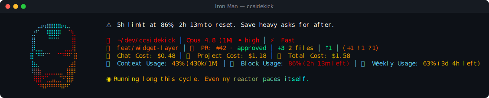

# Iron Man pack

> Fan-made tribute. Character names and likenesses are trademarks of their respective owners; this
> pack is an unofficial, non-commercial homage, not affiliated with or endorsed by them.

◉ **Iron Man** — a reactive ccsidekick character, _edgy_ in tone.

## Statusline



## Figure

```
⠀⠀⠀⣀⡤⣴⣶⣶⣶⣦⢤⣀⠀⠀⠀
⠀⢀⡚⠁⠀⠸⣿⣿⣿⠇⠀⠈⢳⡀⠀
⠀⢸⡇⠀⠀⠀⠉⠉⠉⠀⠀⠀⢸⡇⠀
⠀⢸⢇⣀⡀⠀⠀⠀⠀⠀⢀⣀⡸⡇⠀
⠀⣿⠈⠛⠛⠉⠁⠀⠈⠉⠛⠛⠁⣿⠀
⠀⢸⣦⡀⠀⠀⠀⠀⠀⠀⠀⢀⣴⡇⠀
⠀⠸⣿⣷⠀⣀⣀⣀⣀⣀⠀⣿⣿⠇⠀
⠀⠀⢿⣿⠙⢉⣀⣤⣀⡉⠋⣿⡿⠀⠀
⠀⠀⠀⠙⠻⠟⠛⠛⠛⠻⠟⠋⠀⠀⠀
```

## Voice

One representative line per pool:

- **mood**: New face at the console. Let's see what you've got.
- **greeting**: Morning. New face at the console. I run a scan first.
- **firstContact**: First time at this console. Tony Stark. Try to keep up.
- **milestone**: You leveled up. Don't let it go to your head. That's my job.
- **positiveGit**: Tree's clean. Don't get used to me noticing things.
- **egg**: I am Iron Man. That part everyone already knows.
- **event**: Tests failed. Adorable. I've built better from wreckage.
- **stack**: Waterfall chart's still cascading. Gorgeous. Also glacial.
- **pressure**: Workshop's getting cluttered. Never slowed me down before.
- **dateEgg**: Midnight. The workshop doesn't own a clock for a reason.
- **spinnerVerbs**: Fabricating, Calibrating, Repulsing, Improvising, Weaponizing, Prototyping,
  Recalibrating, Retrofitting, Thrusting, Vectoring, Bootstrapping, Overclocking, Rerouting,
  Diagnosing, Forging, Welding, Rebooting, Optimizing, Iterating, Soldering, Powering up,
  Simulating, Stress-testing, Reactor-tuning, Suit-syncing

## Attribution

- tone: edgy
- emblem: ◉
- artist: emojicombos.com
- source: https://emojicombos.com/iron-man-ascii-art

<!-- generated by `bun run pack-readme <dir>`; do not edit -->
