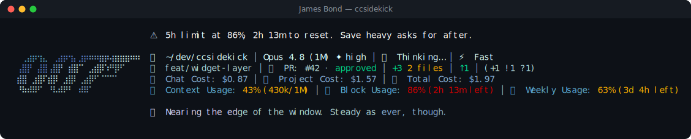

# James Bond pack

> Fan-made tribute. Character names and likenesses are trademarks of their respective owners; this
> pack is an unofficial, non-commercial homage, not affiliated with or endorsed by them.

🍸 **James Bond** — a reactive ccsidekick character, _edgy_ in tone.

## Statusline



## Figure

```
⠀⠀⠀⠀⠀⠀⠀⠀⠀⠀⠀⠀⠀⠀⠀⠀⠀⠀⠀⠀⠀⠀⠀⠀⠀
⠀⠀⠀⠀⠀⠀⠀⠀⠀⠀⠀⠀⠀⠀⠀⠀⠀⠀⠀⠀⠀⠀⠀⠀⠀
⠀⠀⢀⣴⡶⢲⣄⠀⢀⣴⡶⢲⡄⣰⡶⠶⠶⣶⡶⢴⣶⣶⣶⠶⠶
⠀⢠⣿⡟⠀⣼⣿⢠⣿⡟⠀⣾⣿⠉⠀⣠⣾⡿⠱⠛⡿⠋⠀⠀⠀
⠀⣾⣿⠀⣰⣿⠏⣾⡿⠀⣰⣿⠇⢀⣴⡿⠋⠈⠉⠉⠁⠀⠀⠀⠀
⠀⠘⠷⠾⠿⠋⠀⠘⠧⠾⠟⠃⠀⠾⠿⠁⠀⠀⠀⠀⠀⠀⠀⠀⠀
⠀⠀⠀⠀⠀⠀⠀⠀⠀⠀⠀⠀⠀⠀⠀⠀⠀⠀⠀⠀⠀⠀⠀⠀⠀
⠀⠀⠀⠀⠀⠀⠀⠀⠀⠀⠀⠀⠀⠀⠀⠀⠀⠀⠀⠀⠀⠀⠀⠀⠀
⠀⠀⠀⠀⠀⠀⠀⠀⠀⠀⠀⠀⠀⠀⠀⠀⠀⠀⠀⠀⠀⠀⠀⠀⠀
```

## Voice

One representative line per pool:

- **mood**: New hand at the table. I count cards before I count on people.
- **greeting**: Morning. New face. I'll reserve judgment till lunch.
- **firstContact**: First time at this table. Bond. James Bond. Your deal.
- **milestone**: First check passed. I don't hand out trust like canapes.
- **positiveGit**: Tree's clean. No prints, no traces. I still verify.
- **egg**: Off the clock, I still order a martini. Old habits, precise.
- **event**: A red test. Even my luck runs cold before the big hand.
- **stack**: Traffic's thick tonight. Even MI6 waits for clear roads.
- **pressure**: The desk's crowding. I keep only what the mission needs.
- **dateEgg**: Midnight again. Villains keep late hours; so do I.
- **spinnerVerbs**: Infiltrating, Decrypting, Shadowing, Disarming, Wagering, Bluffing, Improvising,
  Escaping, Deducing, Charming, Evading, Interrogating, Surveilling, Outmaneuvering, Gambling,
  Scheming, Cornering, Defusing, Debriefing, Reconnoitering, Vanishing, Outfoxing, Commandeering,
  Neutralizing, Requisitioning, Tailing, Plotting, Maneuvering

## Attribution

- tone: edgy
- emblem: 🍸
- artist: emojicombos.com
- source: https://emojicombos.com/james-bond-ascii-art

<!-- generated by `bun run pack-readme <dir>`; do not edit -->
