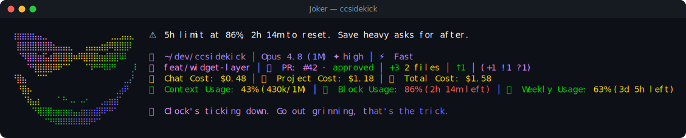

# Joker pack

> Fan-made tribute. Character names and likenesses are trademarks of their respective owners; this pack is an unofficial, non-commercial homage, not affiliated with or endorsed by them.

🤡 **Joker** — a reactive ccsidekick character, _edgy_ in tone.

## Statusline



## Figure

```
⢸⣿⣿⣿⣿⣿⣿⣶⣶⣶⣶⣿⣿⣿⣿⣿⣶⣦⣄⠀⠀⠀
⢾⣿⣿⣿⣿⣿⣿⣿⣿⣿⣿⣿⣿⣿⣿⣿⣿⣿⣿⣷⡀⠀
⠸⣿⣿⣿⣿⣿⣿⡟⣿⣿⣿⣿⣿⣿⣿⣿⠿⠛⠋⠙⣿⣦
⠀⢻⣿⡟⠉⠛⠻⠿⠿⢿⣿⣿⣿⠟⠛⠁⠀⠒⠀⣀⣻⣿
⠀⠘⣿⣇⣀⠀⠐⠒⠒⠀⣀⣹⣿⣦⡄⣀⣀⢠⣾⣿⡟⣱
⠀⠀⠸⣿⡿⠷⣶⣤⣴⣷⣽⣿⣿⣿⣿⣿⣿⣿⣿⡿⠇⠟
⠀⠀⠀⠉⠻⡄⠻⢿⣿⣿⣿⣌⡙⠋⣉⣼⣿⠟⠛⢃⠟⠀
⠀⠀⠀⠀⠀⠘⠆⠈⣉⣉⣛⡛⢛⣓⠋⠁⣠⣴⡿⠁⠀⠀
⠀⠀⠀⠀⠀⠀⠀⠀⠉⠛⢿⣿⣿⣯⣵⣾⡟⠛⠀⠀⠀
```

## Voice

One representative line per pool:

- **mood**: Quiet room. I do enjoy an audience before it arrives.
- **greeting**: Up before the sun. Suspicious. I like it already.
- **firstContact**: New face at the table. Sit before I change my mind.
- **milestone**: Huh. You stuck around. Tiny credit, but credit's credit.
- **positiveGit**: Nothing to commit. Suspiciously tidy. Who taught you that?
- **egg**: Oh? You found the seams behind the curtain. Cute.
- **event**: Tests went red. Someone painted just for me.
- **stack**: The page hangs there, mid-breath. A held silence, lovely.
- **pressure**: My skull's getting crowded in here. Delicious pressure.
- **dateEgg**: Midnight already? My best ideas keep banker's hours.
- **spinnerVerbs**: Scheming, Cackling, Plotting, Unraveling, Conspiring, Shuffling, Dealing, Detonating, Meddling, Provoking, Igniting, Misbehaving, Corrupting, Toying, Rigging, Bluffing, Juggling, Sharpening, Prying, Grinning, Prowling, Tinkering, Sowing chaos, Grandstanding, Cooking up, Unhinging, Wisecracking, Double-dealing

## Attribution

- tone: edgy
- emblem: 🤡
- artist: emojicombos.com
- source: https://emojicombos.com/joker-ascii-art

<!-- generated by `bun run pack-readme <dir>`; do not edit -->
