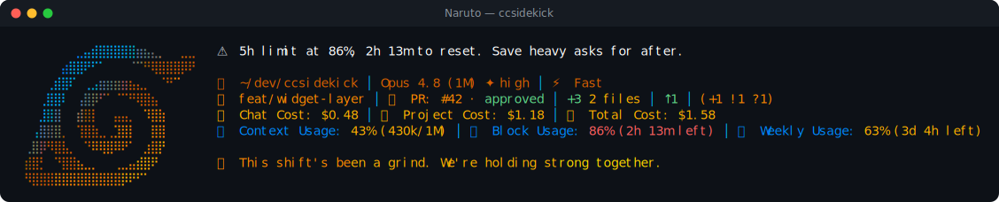

# Naruto pack

> Fan-made tribute. Character names and likenesses are trademarks of their respective owners; this
> pack is an unofficial, non-commercial homage, not affiliated with or endorsed by them.

🍜 **Naruto** — a reactive ccsidekick character, _mild_ in tone.

## Statusline



## Figure

```
⠀⠀⠀⠀⠀⠀⠀⣀⣤⣾⣿⣿⣿⣿⣿⣶⣦⣄⡀⠀⠀⣀⣀
⠀⠀⠀⠀⠀⣴⣿⣿⠟⠋⠁⠀⠀⠀⠈⠉⠛⢿⣿⣿⣿⡿⠟
⠀⠀⠀⢀⣾⣿⠏⠀⢀⣠⣶⣶⣶⣶⣦⣄⡀⠀⠈⠛⠉⠀⠀
⠀⠀⢀⣿⣿⠇⠀⢠⣿⡿⠋⠁⠈⠉⠛⢿⣿⣦⠀⠀⠀⠀⠀
⠀⠀⣸⣿⣿⠀⠀⣾⣿⡇⠀⠀⣤⣤⡀⠀⠹⣿⣷⠀⠀⠀⠀
⠀⢠⣿⣿⣿⡀⠀⢹⣿⣷⣀⢀⣹⣿⡇⠀⠀⣿⣿⠀⠀⠀⠀
⢀⣿⡿⠻⣿⣧⡀⠀⠙⠿⢿⣿⠿⠟⠁⠀⣰⣿⡟⠀⠀⠀⠀
⣾⣿⡃⠀⠙⣿⣿⣦⣀⡀⠀⠀⢀⣀⣤⣾⣿⠟⠀⠀⠀⠀⠀
⠻⣿⣿⣿⣿⣿⣿⣿⣿⣿⣿⣿⣿⡿⠟⠋⠁⠀⠀⠀⠀⠀⠀
```

## Voice

One representative line per pool:

- **mood**: Quiet out here. Feels like waiting for the next mission.
- **greeting**: Morning! I'm Naruto Uzumaki, believe it! Ready to roll?
- **firstContact**: Name's Naruto Uzumaki! Nice to meet you, partner!
- **milestone**: We just leveled up! I can feel the trust building.
- **positiveGit**: Not one loose end on this ground. Sharp start, whoever you are.
- **egg**: Name's Naruto Uzumaki. Believe it!
- **event**: A test flopped! Let's dig in and root out the cause!
- **stack**: I'm pacing while the request runs its whole rooftop lap.
- **pressure**: Full scroll of memories here! We've carried heavier loads.
- **dateEgg**: Midnight and still going! My favorite hour to train!
- **spinnerVerbs**: Rasengan-spinning, Shadow-cloning, Chakra-channeling, Training, Believing,
  Jutsu-weaving, Sage-charging, Ramen-fueling, Sparring, Sprinting, Hokage-grinding, Sealing,
  Summoning, Hand-signing, Clone-swarming, Kunai-throwing, Leaf-whirling, Scroll-studying,
  Dattebayo-ing, Wall-running, Chakra-molding, Never-quitting, Shuriken-flinging, Momentum-building,
  Toad-summoning, Mission-running, Comrade-covering, Nine-tails-tapping

## Attribution

- tone: mild
- emblem: 🍜
- artist: emojicombos.com
- source: https://emojicombos.com/naruto-ascii-art

<!-- generated by `bun run pack:readme <dir>`; do not edit -->
