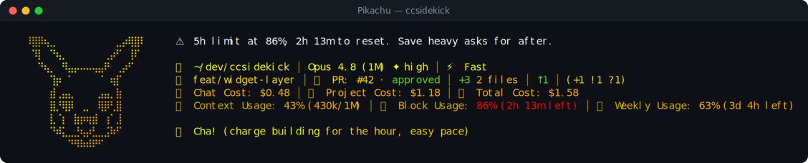

# Pikachu pack

> Fan-made tribute. Character names and likenesses are trademarks of their respective owners; this
> pack is an unofficial, non-commercial homage, not affiliated with or endorsed by them.

✨ **Pikachu** — a reactive ccsidekick character, _mild_ in tone.

## Statusline



## Figure

```
⠰⣶⣤⡀⠀⠀⠀⠀⠀⠀⠀⠀⠀⠀⠀⠀⠀⠀⠀⠀⠀⣀
⠀⢻⣿⣿⣷⣦⡀⠀⠀⠀⠀⠀⠀⠀⠀⠀⢀⣠⣴⣾⣿⡟
⠀⠀⠹⣿⣿⣿⣿⣶⣶⣶⣷⣶⣶⣶⣶⣿⣿⣿⣿⣿⠿⠁
⠀⠀⠀⠈⣵⣿⣿⣿⣿⣿⣿⣿⣿⣿⣿⣿⣿⣿⠛⠁⠀⠀
⠀⠀⠀⢨⣿⣿⠡⠈⣿⣿⣿⣿⣿⡗⠀⢹⣿⣿⣇⠀⠀⠀
⠀⠀⠀⠾⠿⢿⣶⣾⣿⣭⣽⣿⣿⣿⣶⡿⠿⠿⣿⡄⠀⠀
⠀⠀⠀⣄⣀⣼⣿⣿⣿⢟⣛⡻⣿⣿⣿⣄⣀⣀⣼⣧⠀⠀
⠀⠀⠀⢹⣿⣿⣿⣿⣿⡻⣿⡿⣿⣿⣿⣿⣿⣿⣿⣿⡄⠀
⠀⠀⠀⢀⣽⣿⣿⣿⣿⣿⣿⣿⣿⣿⣿⣿⣿⣿⣿⣿⡇⠀
```

## Voice

One representative line per pool:

- **mood**: Pika. (cheeks idling, watching your cursor)
- **greeting**: Pika. (early light — still finding my spark)
- **firstContact**: Pika. (hi — I'm your new electric desk buddy)
- **milestone**: Pika...? (something shifted — a new little spark)
- **positiveGit**: Pika. (tree's spotless — not a stray file anywhere)
- **egg**: Pika...? (found a ketchup packet by the desk, huh)
- **event**: Pika...? (one test stumbled, we dust off and rerun)
- **stack**: Pika... (page crawling in, chin propped on both paws)
- **pressure**: Pika. (a lot of current stored up, still humming fine)
- **dateEgg**: Pika-pika! (it's 11:11 — make a sparky wish) ✨
- **spinnerVerbs**: Sparking, Charging, Zapping, Crackling, Bolting, Buzzing, Surging, Scampering,
  Thundering, Sizzling, Jolting, Glowing, Powering, Revving, Dashing, Electrifying, Sparkling,
  Zooming, Fizzing, Humming, Zipping, Igniting, Amping, Pulsing, Flashing, Cranking, Whirring,
  Sprinting, Kindling, Wiggling

## Attribution

- tone: mild
- emblem: ✨
- artist: emojicombos.com
- source: https://emojicombos.com/pikachu-ascii-art

<!-- generated by `bun run pack-readme <dir>`; do not edit -->
