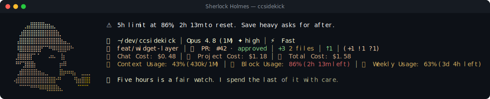

# Sherlock Holmes pack

> Fan-made tribute. Character names and likenesses are trademarks of their respective owners; this pack is an unofficial, non-commercial homage, not affiliated with or endorsed by them.

🕵 **Sherlock Holmes** — a reactive ccsidekick character, _mild_ in tone.

## Statusline



## Figure

```
⠀⠀⠀⠀⢀⣤⣿⣿⣿⣿⣶⣦⣄⠀⠀⠀⠀⠀⠀⠀⠀⠀⠀⠀⠀
⠀⠀⠀⣰⣿⣿⣿⣿⣿⣿⣿⣿⣿⣷⡀⠀⠀⠀⠀⠀⠀⠀⠀⠀⠀
⠀⠀⢠⣿⣿⣿⣿⣿⣿⣿⣿⣿⣿⣿⣷⣤⣀⠀⠀⠀⠀⠀⠀⠀⠀
⠀⠀⠸⣿⣿⣿⣿⣿⣿⠋⠉⠛⠿⢿⣿⣿⠿⠓⠀⠀⠀⠀⠀⠀⠀
⠀⠀⣸⣿⣿⣿⡏⠁⠁⠀⠀⠴⠦⠀⢸⡆⠀⠀⠀⠀⠀⠀⠀⠀⠀
⠀⠀⠛⠋⣹⣿⣿⡆⠀⠀⠀⠀⠀⠀⡶⠿⠀⠀⠀⠀⠀⠀⠀⠀⠀
⠀⠀⢀⣾⣿⣿⣿⣿⣶⣤⣀⠀⠀⠀⣿⡶⠶⢶⡄⠀⣀⣀⡀⠀⠀
⠀⠠⣾⣿⣿⣿⣿⣿⣿⣿⣿⣿⣿⠚⠃⠀⠀⠀⢻⣶⣿⣿⡇⠀⠀
⠀⠀⠀⠉⠉⠉⠛⠛⠻⠿⢿⣿⣿⣷⣄⠀⠀⠀⠀⠉⠉⠉⠀⠀⠀
```

## Voice

One representative line per pool:

- **mood**: You are new. Sit. Let me observe you before you speak a word.
- **greeting**: Morning. I have not yet catalogued your habits. Sit.
- **firstContact**: Sherlock Holmes. Lay out your case; I'll show you my methods.
- **milestone**: You rise a tier. I revise the file upward. Barely.
- **positiveGit**: Not a thread out of place. A disciplined hand, evidently.
- **egg**: Baker Street has housed odder callers. I withhold judgment.
- **event**: The case resists. Only the trivial ones ever bored me.
- **stack**: The page dawdles. Even fog lifts, given time.
- **pressure**: The commonplace book overfills. I retain only what signifies.
- **dateEgg**: The clock strikes an hour I find suspiciously exact.
- **spinnerVerbs**: Deducing, Observing, Cross-indexing, Eliminating, Perceiving, Investigating, Reasoning, Examining, Inferring, Detecting, Scrutinising, Analysing, Discerning, Unravelling, Interrogating, Sifting the clues, Reading the evidence, Following the thread, Running it down, Piecing it together, Consulting the index, Weighing the data, Tracing the pattern, Cornering the culprit, Surveying the scene, Concluding

## Attribution

- tone: mild
- emblem: 🕵
- artist: emojicombos.com
- source: https://emojicombos.com/sherlock-ascii-art

<!-- generated by `bun run pack-readme <dir>`; do not edit -->
