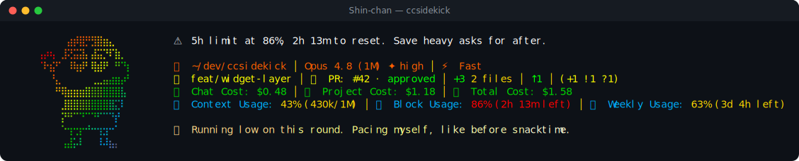

# Shin-chan pack

> Fan-made tribute. Character names and likenesses are trademarks of their respective owners; this
> pack is an unofficial, non-commercial homage, not affiliated with or endorsed by them.

🖍 **Shin-chan** — a reactive ccsidekick character, _edgy_ in tone.

## Statusline



## Figure

```
⠀⠀⠀⠀⠀⣴⡾⣿⡛⣻⣿⣶⣄⠀⠀⠀
⢠⡴⢦⠀⣸⢝⣭⣽⡄⣼⣭⡙⠏⣷⡀⠀
⠈⠗⣮⠋⠀⠸⢷⡾⠃⢿⣾⠟⠀⠛⠙⡆
⠀⠀⠘⣄⠀⠀⠀⠀⠀⢀⣀⣤⣴⣶⡴⠃
⠀⠀⠀⠛⢿⣶⣶⣶⣿⣿⣿⣿⣿⣿⣧⠀
⠀⠀⠀⠀⣸⣿⣿⣿⣿⣿⣿⣿⣿⣍⠇⠀
⠀⠀⠀⠀⡝⠛⠉⠙⠉⠙⠋⠉⠙⡞⠀⠀
⠀⠀⠀⠀⠑⢲⢒⡖⠚⠒⢲⣲⠒⠁⠀⠀
⠀⠀⠀⠀⢠⣼⡥⠇⠀⠀⠸⠼⣦⡄⠀⠀
```

## Voice

One representative line per pool:

- **mood**: New face at the keyboard. Not showing you my best tricks yet.
- **greeting**: Up already? Not trusting morning people just yet.
- **firstContact**: Hi! Ora's Shinnosuke. Most people call me Shin-chan though.
- **milestone**: Whoa, you leveled up already? Ora's kinda impressed.
- **positiveGit**: Not a speck left in this tree. Suspicious levels of clean.
- **egg**: Shinnosuke Nohara. Five years old. Remember the name.
- **event**: Test flopped. Ora's fallen off worse before. Gets back up.
- **stack**: Page's still loading. Ora's grabbed two snacks waiting on it.
- **pressure**: My notebook's getting full. Still room for one more page.
- **dateEgg**: Another year gone. Ora's still five forever, somehow.
- **spinnerVerbs**: Wiggling, Snacking, Doodling, Bouncing, Giggling, Daydreaming, Chocobi-munching,
  Humming, Skipping, Wobbling, Napping, Wandering, Pondering, Nibbling, Twirling, Fidgeting,
  Waddling, Elephant-dancing, Puttering, Rummaging, Toddling, Zooming, Dilly-dallying, Shuffling,
  Tiptoeing, Butt-wiggling, Crayon-scribbling, Shiro-petting

## Attribution

- tone: edgy
- emblem: 🖍
- artist: emojicombos.com
- source: https://emojicombos.com/shinchan-ascii-art

<!-- generated by `bun run pack:readme <dir>`; do not edit -->
