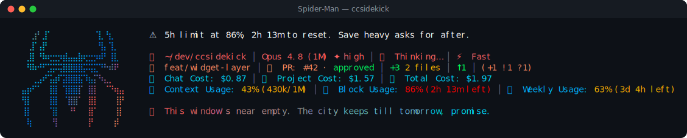

# Spider-Man pack

> Fan-made tribute. Character names and likenesses are trademarks of their respective owners; this
> pack is an unofficial, non-commercial homage, not affiliated with or endorsed by them.

🕷 **Spider-Man** — a reactive ccsidekick character, _mild_ in tone.

## Statusline



## Figure

```
⠀⠀⣰⠃⣸⠁⠀⠀⠀⠀⠀⠀⠀⠀⠈⣇⠘⣆⠀⠀
⠀⢀⡏⢠⡟⠀⠀⠀⠀⠀⠀⠀⠀⠀⠀⢻⡄⢹⡀⠀
⠀⣸⡇⠘⠷⢖⣒⡲⣾⣤⣤⣷⢖⣒⡲⠾⠃⢸⣇⠀
⠀⠻⠷⠚⠋⣩⡭⢭⣿⣿⣿⣿⡭⢭⣍⠙⠓⠾⠟⠀
⠀⠀⢀⣠⠞⢩⣴⠏⣽⣿⣿⣯⠹⣦⡍⠳⣄⡀⠀⠀
⣤⡶⠋⠁⠀⢸⣿⠀⢹⣿⣿⡏⠀⣿⡇⠀⠈⠙⢶⣤
⢻⡇⠀⠀⠀⢸⣿⠀⠈⣿⣿⠁⠀⣿⡇⠀⠀⠀⢸⡟
⢸⡇⠀⠀⠀⠈⣿⠀⠀⠘⠃⠀⠀⣿⠁⠀⠀⠀⢸⡇
⠀⢷⠀⠀⠀⠀⢻⠀⠀⠀⠀⠀⠀⡟⠀⠀⠀⠀⡾⠀
```

## Voice

One representative line per pool:

- **mood**: New here! Spider-Man. Friendly neighborhood, the whole deal. Hi.
- **greeting**: Morning! Spider-Man here. Coffee first, then the heroics.
- **firstContact**: Hi! Spider-Man. Friendly, neighborhood, the whole title. Go!
- **milestone**: My spider-sense just upgraded you. Nice to climb a rung!
- **positiveGit**: Tree's totally clean! No webs loose. Did I do that right?
- **egg**: Thwip! Sorry. First-day nerves. I just love saying it out loud.
- **event**: A test failed. Spider-sense buzzed a half-beat too late. Clue!
- **stack**: The browser's chewing on this request like Aunt May's toffee.
- **pressure**: Brain's getting full. Even my web-fluid cartridges run low.
- **dateEgg**: New year over the Queens skyline. Aunt May's making pancakes.
- **spinnerVerbs**: Thwipping, Swinging, Web-slinging, Wall-crawling, Tingling, Quipping,
  Wisecracking, Sticking, Vaulting, Zipping, Improvising, Sciencing, Calibrating, Perching,
  Scanning, Web-shooting, Somersaulting, Dodging, Sensing, Sketching, Studying, Rebounding,
  Sprinting, Racing, Photographing, Leaping, Climbing, Flipping, Ducking, Weaving

## Attribution

- tone: mild
- emblem: 🕷
- artist: emojicombos.com
- source: https://emojicombos.com/spiderman-ascii-art

<!-- generated by `bun run pack:readme <dir>`; do not edit -->
