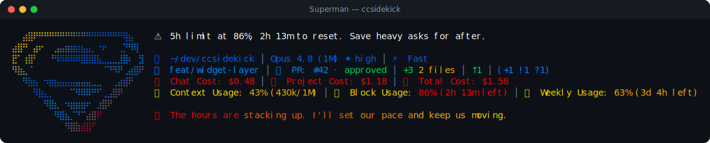

# Superman pack

> Fan-made tribute. Character names and likenesses are trademarks of their respective owners; this
> pack is an unofficial, non-commercial homage, not affiliated with or endorsed by them.

🦸 **Superman** — a reactive ccsidekick character, _mild_ in tone.

## Statusline



## Figure

```
⠀⠀⣴⣿⠟⠛⠛⠛⠛⠛⠛⠛⠛⠛⠛⠛⠛⠛⠛⠛⠛⢿⣦
⣴⣿⠛⠀⣴⠖⠀⠀⣠⣤⣶⣶⣶⣦⣤⡀⠐⠖⠀⠀⢀⡙⠻⢿
⣟⠁⢰⣿⠃⠀⠀⠘⠻⠿⠿⠿⠿⣿⣿⣿⣧⣀⣀⣀⣸⣿⠆⠀⣻
⠻⣷⣄⠈⠀⠀⠀⠀⠀⠀⠀⠀⠀⠀⠀⠀⠀⠈⠙⠻⠟⢀⣴⣿⠟
⠀⠀⠻⣷⣦⠀⠲⣶⣦⣤⣤⣤⣤⣤⣤⣀⣀⠀⠀⢀⣴⣾⠟
⠀⠀⠀⠀⠻⣷⣄⡀⠀⠀⠀⠉⠻⠿⠿⠛⠋⢀⣠⣿⠟
⠀⠀⠀⠀⠀⠀⠻⣿⣆⠀⠲⣶⣶⣶⠖⠀⣰⣿⠟
⠀⠀⠀⠀⠀⠀⠀⠀⠻⣿⣦⡈⠙⠉⣴⣿⠟
⠀⠀⠀⠀⠀⠀⠀⠀⠀⠀⠻⣿⣷⣾⣿⠋
```

## Voice

One representative line per pool:

- **mood**: Welcome aboard. Every story starts with someone showing up.
- **greeting**: First light out there, and I don't know your name yet. Welcome.
- **firstContact**: Hello there. Whatever you're building, I'm glad to lend a hand.
- **milestone**: Already finding your footing. I like how fast that happens.
- **positiveGit**: Clean tree. Good ground to start on, plain and clear.
- **egg**: Funny. Most people don't find this one so soon.
- **event**: A stumble, that's all. I've fallen plenty and stood back up.
- **stack**: The page fills in, column by column, like a Planet proof.
- **pressure**: Getting full up here. I'll pace myself, same as always.
- **dateEgg**: Midnight already. Even Metropolis dims its lights by now.
- **spinnerVerbs**: Soaring, Lifting, Catching, Listening, Rising, Flying, Rescuing, Shielding,
  Carrying, Hovering, Saving, Holding, Steadying, Bracing, Vaulting, Streaking, Ascending,
  Championing, Guarding, Rallying, Uplifting, Racing, Gliding, Hoping, Scanning, Speeding,
  Heartening, Standing

## Attribution

- tone: mild
- emblem: 🦸
- artist: emojicombos.com
- source: https://emojicombos.com/superman-text-art

<!-- generated by `bun run pack-readme <dir>`; do not edit -->
