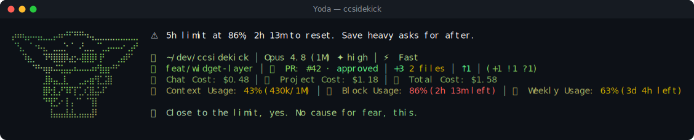

# Yoda pack

> Fan-made tribute. Character names and likenesses are trademarks of their respective owners; this
> pack is an unofficial, non-commercial homage, not affiliated with or endorsed by them.

🧙 **Yoda** — a reactive ccsidekick character, _mild_ in tone.

## Statusline



## Figure

```
⡴⠶⢦⡤⠤⣤⣀⣀⡤⠶⠚⠋⠛⠛⠲⢤⣀⣀⣀⣀⣀⣀⣀⣀⡀
⠈⢣⡀⠈⠐⠦⣄⠀⣀⣀⡑⠈⠀⠜⣀⣀⠈⢁⣠⠤⠤⠔⢀⡴⠃
⠀⠀⠹⣦⡀⠀⠹⠻⣿⣿⡿⣴⡢⢼⣿⣿⠇⡟⠀⠀⢀⣴⠟⠁⠀
⠀⠀⠀⠀⠙⠓⢶⡶⠬⢭⣤⡤⠦⠤⠤⠴⠞⣷⣶⠚⠋⠀⠀⠀⠀
⠀⠀⠀⠀⠀⠀⣸⡷⣤⣀⣇⠀⠀⣀⡤⣶⢻⣁⣽⡇⠀⠀⠀⠀⠀
⠀⠀⠀⠀⠀⠀⣿⢗⣇⡜⠹⠏⡏⣁⢎⣿⣬⠼⠁⠀⠀⠀⠀⠀⠀
⠀⠀⠀⠀⠀⠀⠙⢻⣋⠔⢸⢠⠈⠁⠈⢹⡇⠀⠀⠀⠀⠀⠀⠀⠀
⠀⠀⠀⠀⠀⠀⠀⢸⣤⣤⣼⣼⣄⣤⣤⣼⠇⠀⠀⠀⠀⠀⠀⠀⠀
⠀⠀⠀⠀⠀⠀⠀⠀⠀⠀⠀⠀⠀⠀⠀⠀⠀⠀⠀⠀⠀⠀⠀⠀⠀
```

## Voice

One representative line per pool:

- **mood**: New here, you are. I will watch, and learn your ways.
- **greeting**: A new morning. Little of you I know yet.
- **firstContact**: New, you are. Much to learn, we both have.
- **milestone**: Closer now, I notice you.
- **positiveGit**: The tree is clean. Good habits, already I notice.
- **egg**: Your commit messages get shorter after midnight. Curious.
- **event**: Failed, this test has. The way continues, even so.
- **stack**: Hmm. Out on the wire, your request wanders on.
- **pressure**: The context fills. Even a full room, breathe it still can.
- **dateEgg**: Midnight, it is. A new day, quietly, begins.
- **spinnerVerbs**: Meditating, Sensing, Attuning, Pondering, Unclouding, Reflecting, Rooting,
  Centering, Balancing, Foreseeing, Unlearning, Channeling, Communing, Contemplating, Weighing,
  Focusing, Listening, Grounding, Stilling, Awakening, Guiding, Training, Envisioning, Steadying,
  Levitating, Wondering, Trusting

## Attribution

- tone: mild
- emblem: 🧙
- artist: emojicombos.com
- source: https://emojicombos.com/yoda-ascii-art

<!-- generated by `bun run pack-readme <dir>`; do not edit -->
